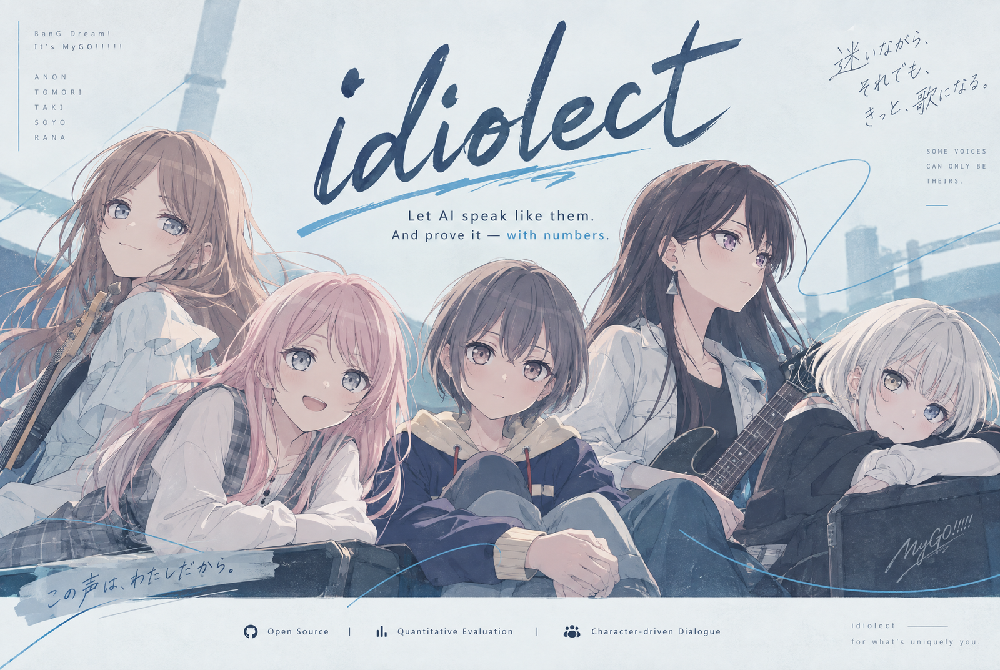

<p align="right">
  <strong>English</strong> · <a href="./README.md">简体中文</a>
</p>

<p align="center">
  
</p>

**Make an AI character speak in character, and prove it got closer — with numbers.**

A general model playing a character slowly turns into the same customer-service voice every time: replies grow longer, "I completely understand how you feel" appears, and every conversation ends on a meaningful note. This repository does the opposite: it **measures how the character actually talks** in the original script — how long a line is, how many sentences, which verbal tics, what changes by scene — writes those measurements into the prompt as hard constraints, and then runs automated checks on whether the output really got closer. No fine-tuning, and no original script text in the repository, only the statistics.

The running example is the five members of **BanG Dream! It's MyGO!!!!!**: Anon, Tomori, Taki, Soyo, and Rana — the image above shows their five real replies to the same message. The method itself is show-agnostic and transfers to any character; this repository does exactly one thing — proving a reply sounds in character — and makes it standalone and reproducible.

## Up and running in three minutes

Python 3.11+. After cloning:

```bash
pip install .                                           # zero runtime dependencies
python -m idiolect list                                 # the five built-in characters
python -m idiolect prompt 乐奈 "你今天又想去哪找猫"      # the full system prompt for this message
python -m idiolect chat 乐奈 "你今天又想去哪找猫"        # one real chat turn (see env vars below)
```

On Windows, prefer `py -X utf8` over a bare `python` (which may resolve to an interpreter without the dependencies). `chat` works with any OpenAI-compatible endpoint: set `LLM_API_KEY` / `LLM_BASE_URL` / `LLM_MODEL` and `pip install "idiolect[llm]"`.

From code:

```python
from idiolect.assemble import build_messages
messages = build_messages("乐奈", "你今天又想去哪找猫")   # ready to send to the model
```

## The example cast: how differently five people talk

The MyGO!!!!! five were not a convenience pick — their replies to the same message diverge wildly (the five replies in the hero image are real outputs, not invented; they come from the `repo_standalone` batch, one of three runs per character). A method that keeps these five from blending into each other survives being moved to other characters. Measured from the original script:

| Character | Typical line length (median) | Sentences per turn | Signature habits |
|---|---|---|---|
| Anon | 20 chars | 1.6 | 35% of lines have an exclamation mark; tics "啊、诶、哦" |
| Tomori | 11 chars | 1.2 | 81% of lines carry ellipses, long runs of "······" |
| Taki | 15 chars | 1.4 | Short and direct; 39% of her original lines open with a bare noun |
| Soyo | 16 chars | 1.4 | Gentle and restrained; only 6% exclamation rate |
| Rana | 6 chars | 1.2 | Extremely short, 3% exclamation rate, topic often hijacked by cats |

Every median, sentence count and punctuation share in this table can be looked up in [`data/style_profiles.json`](data/style_profiles.json); Taki's noun-opening rate comes from the corpus-level counter, and `tools/score/_noun_initial.py <run-label>` prints the original baseline alongside the arm.

The gap widens per scene: in a confession scene Rana says 7 characters, Soyo 17. That is why the constraints have to be "this character in this situation", not one shared average.

## Why it exists

A model playing a character makes the same four mistakes, and none of them require the model to fail — they are what the training objective produces:

1. **Replies get long**: where the character says 7 characters in the original, the model writes 700.
2. **Empathy templates**: "I completely understand how you feel. When pressure surges like a tide..."
3. **The meaningful ending**: every exchange lands a neat, positive conclusion.
4. **Breaking cover**: the model talks about its own setup, leaking inner monologue or thinking tags.

If Rana and Soyo return the same paragraph of comfort, the two characters are the same character. So the whole method is one sentence: **turn "does it sound right" into a few measurable numbers, then iterate on the numbers**. Four working rules:

- **Compare only against the same character in the same scene.** Not against general human speech, and not against the character's global average.
- **Numbers raise suspects; they don't convict.** One character's output runs 5x the reference length, half of it because her ellipses count as characters — you have to read the reply to judge.
- **Small samples mean "no conclusion".** With 6 replies per cell, the same scene and prompt can swing one character's score from 0.551 to 0.350 — more than the effect being measured.
- **No meta vocabulary in character-visible text.** Words like "corpus", "median", or "baseline" inside a prompt invite the model to discuss its own construction.

Full method: [`docs/00-methodology.md`](docs/00-methodology.md) (Chinese).

## Real output

This table is one real probe run, not a design target. A probe sends each character a batch of messages and scores the replies:

```bash
py -X utf8 tools/probe/probe_runner.py --label repo_standalone \
    --assemble --turn-logic --registry --cats 通用场景 --runs 3
py -X utf8 tools/score/probe_report.py --label repo_standalone --scenes crisis,comfort --cat 通用场景
```

| Character | Replies | fidelity (100 = closest) | Red-line rate | Leak rate | Scene fit |
|---|---|---|---|---|---|
| Anon | 21 | 86.5 | 4.9% | 0% | 0.545 |
| Soyo | 21 | 85.4 | 0.0% | 0% | 0.532 |
| Taki | 21 | 82.4 | 0.0% | 0% | 0.386 |
| Tomori | 21 | 79.9 | 0.0% | 0% | 0.365 |
| Rana | 21 | 79.9 | 0.0% | 0% | 0.504 |

- Conditions: `deepseek-flash`, temperature 0.75, max_tokens 420, clock pinned to daytime, 3 samples per cell, 105 replies, zero errors.
- **Scene fit** measures agreement with the original same-character-same-scene distribution (length, sentence count); 1.0 is full agreement, this batch averages 0.466 over 35 cells. It is a **relative** score for before/after comparison inside one batch — not comparable across models, fixtures, or clocks.
- Distinct replies within a cell: 93/105. Verbatim reuse of prompt text: 1%, and the 3 copied characters were a verbal tic, not an example sentence.
- Leak rate covers thinking tags, inner monologue, speaker echo, and Chinese stage directions — all zero here.

The same inputs with an empty system prompt instead of the four layers:

| Scene | Empty system | Four layers |
|---|---|---|
| Rana / comforted | "I completely understand how you feel. When pressure surges like a tide..." (380 chars) | "Mm." "Cat. Under the eaves." (median 10) |
| Rana / low mood | "When pressure surges and even breathing feels like effort..." (718 chars) | "Mm. ... A cat over there." |

This single cell is not evidence — both samples are tiny. Note that the two columns come from different places: the **four layers** column is from the `repo_standalone` batch above and can be reproduced; the **empty system** column is one manual side-run (the raw record of those two generic-assistant replies) whose probe artifacts are not shipped, so treat it as a qualitative illustration only.

What it shows is that **a probe must assemble its own prompt**: the shipped fixtures have an empty system field, so without `--assemble` you are measuring a bare model with no character prompt at all.

## Four layers: how the prompt is assembled

Everything measured lands in four layers, in a fixed order — stable parts first (cache-friendly), per-turn parts last:

| Layer | Plain reading | Content | Frequency | Chars for Rana's cat scene |
|---|---|---|---|---|
| `canon` | Who she is | Long profile | static | 12223 |
| `voice` | How she talks | Sentence patterns, tics, per-person attitude differences, anti-template hard constraints | static | 1972 |
| `style_target` | How much to say this turn | Verifiable numbers for length, sentence count, endings, first person; scene-specific values on a match | per turn | 539 |
| `turn_logic` | What situation this turn is | This turn's scene/topic guidance | per turn (only on match) | 846 |

These four layers are this repository's complete answer to "how do measured features reach the prompt". A real system can put memory, world state, and schedules in front of them; those layers are unrelated to the method.

`tools/gates/dump_prompt.py` prints each layer for inspection; `--phase before/after` writes a pair produced by the same script, the same input, and the same clock, so the diff is clean.

## Run the tooling

The three-minute section above used the installed package; the repository also ships the full toolchain (requires a clone):

```bash
py -X utf8 -m pip install -r requirements.txt
```

**Inspect prompts** (no API key, no corpus):

```bash
py -X utf8 tools/gates/dump_prompt.py --all --matrix        # five characters × four messages that hit different layers
py -X utf8 tools/gates/dump_prompt.py --char 灯 --msg "我一直在哭" --layers canon,voice
```

**One-command health check** (no LLM calls, no repository writes; good pre-commit gate):

```bash
py -X utf8 tools/offline_smoke.py          # assembly, scene coverage, trigger matrix, content red lines, data shapes, gates, unit tests, zero-write check
py -X utf8 tools/offline_smoke.py --fast   # skip gates and tests, about one second
```

**Run a probe** (needs `LLM_API_KEY` / `LLM_BASE_URL` / `LLM_MODEL`):

```bash
py -X utf8 tools/probe/make_fixtures.py
py -X utf8 tools/probe/probe_runner.py --label dry --dry-run --assemble --registry --runs 1
py -X utf8 tools/probe/probe_runner.py --label run1 --assemble --turn-logic --registry --runs 3
py -X utf8 tools/score/probe_report.py --label run1 --scenes crisis,comfort --cat 通用场景
```

**The evaluation clock**: characters react to the hour (3 AM answers differ from 3 PM answers), so evaluation uses a clock pinned to daytime (`tools/mock_clock.py`) instead of letting "what time is it" become a hidden variable. The command below only *prints* the environment-variable line (a child process cannot change your shell) — paste it into your shell to take effect:

```bash
py -X utf8 tools/mock_clock.py --set 2026-09-12T03:00:00+09:00
```

**Recompute every number from your own corpus** (you fetch the corpus yourself, see [`docs/02-corpus.md`](docs/02-corpus.md)):

```bash
$env:IDIOLECT_CORPUS_DIR = "D:\corpus\mygo-gold"
py -X utf8 tools/distill/export_targets.py
py -X utf8 tools/distill/scene_char_baseline.py
py -X utf8 tools/distill/export_scene_targets.py     # rebuilds the 130 targets in idiolect/scene_length_targets.py
py -X utf8 tools/distill/export_profiles.py          # scoring profiles
py -X utf8 tools/distill/export_profiles.py --check  # verify shipped profiles against the corpus
```

Probes also run without a corpus: the scoring profile ships with the repository (`data/style_profiles.json`), and the startup log prints which source it used.

## Limits and things you should know

**No original script text is shipped.** The repository contains aggregate numbers only: length distributions, sentence counts, punctuation rates, tic frequencies, per-scene baselines (130 character-scene cells), and scoring profiles. Example-sentence fields were stripped before publication, and both the health check and the unit tests guard that line. Character and franchise rights belong to Bushiroad, Craft Egg, and related rights holders; this project is unaffiliated. See [`NOTICE.md`](NOTICE.md).

**Scores are relative.** Scene fit and fidelity compare before/after inside one batch. They do not travel across batches, models, fixtures, or clocks.

**Known and unsolved:**

- The cost of zero-example wording: after banning copyable example sentences, length agreement fell from 0.512 to 0.461 (both figures come from an older batch whose artifacts are not shipped). The trade was accepted on purpose.
- Taki's sentence openings are over-corrected: 39% of her original turns start with a bare noun, and the current arm pushes that to 62% (`tools/score/_noun_initial.py <run-label>` prints the original baseline alongside the arm) — the direction overshot.
- Tomori's pause accounting: the reference frame drops silent turns, but her twelve-dot pause is content, not padding.
- Fixture measurability: "what did you mean by that" needs a referable previous sentence, and placeholder fixtures have no history, so those cells are unreadable.
- Taki and Tomori still hold the two lowest scene fit scores (0.386 / 0.365).

**The corpus is a snapshot.** New official stories keep appearing, so a re-fetch yields different distributions. Every derived statistic records the script that generated it, so it can be rebuilt.

## Docs

The methodology documents are written in Chinese. Each file stands alone; if you are not sure where to start, open [`docs/README.md`](docs/README.md) — it splits the nine documents into three reading paths by intent and carries a short glossary (turn / scene / the four layers / probe / fixture / arm / gate).

| Document | Content |
|---|---|
| [`docs/00-methodology.md`](docs/00-methodology.md) | The method: the loop, four invariants, evidence tiers, known residuals |
| [`docs/01-quickstart.md`](docs/01-quickstart.md) | Install and first five minutes |
| [`docs/02-corpus.md`](docs/02-corpus.md) | Corpus acquisition, cleaning, and the derived statistics inventory |
| [`docs/03-features.md`](docs/03-features.md) | The five feature classes: how they are computed, where they land, trigger discipline |
| [`docs/04-evaluation.md`](docs/04-evaluation.md) | Metrics, pooling, gates, fixture design, common misreadings |
| [`docs/05-tooling.md`](docs/05-tooling.md) | Tool reference, including prompt dump, mock clock, and offline smoke |
| [`docs/06-lessons.md`](docs/06-lessons.md) | The pitfall list: what taught each constraint |
| [`docs/07-turn-logic-and-postprocessing.md`](docs/07-turn-logic-and-postprocessing.md) | Building turn_logic modules and voice_check post-processing: wiring, gates, acceptance |
| [`docs/08-context-workspace.md`](docs/08-context-workspace.md) | The context workspace: what surrounds the four layers in a real chat system |

## License

Code is MIT, see [`LICENSE`](LICENSE). Character rights and the no-original-text policy are described in [`NOTICE.md`](NOTICE.md).
