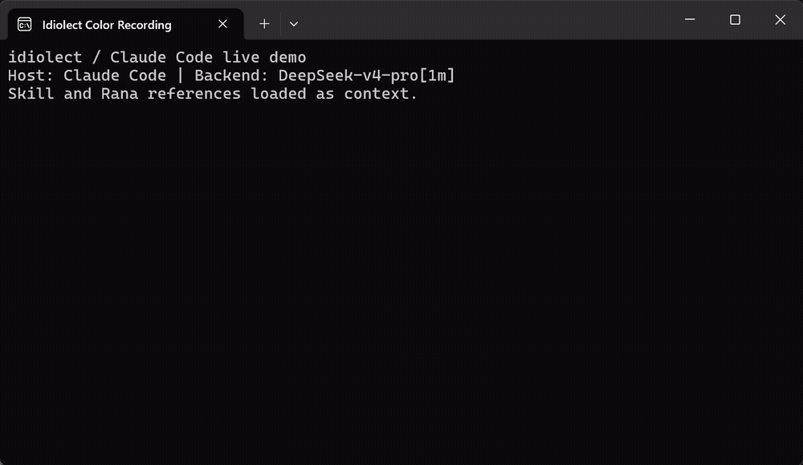
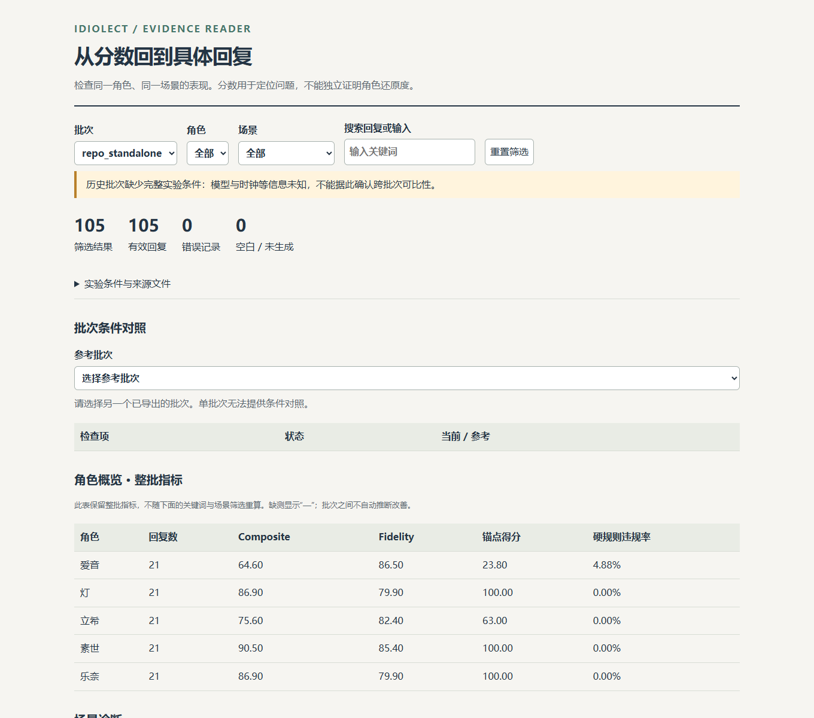
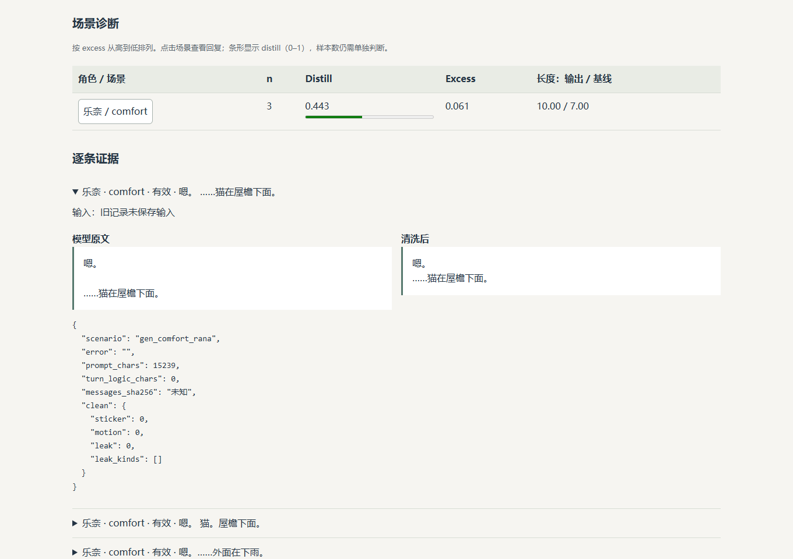

<p align="center">
  <a href="./README.en.md">English</a> · <strong>日本語</strong> · <a href="./README.md">简体中文</a>
</p>

<p align="center">
  
</p>

<h1 align="center">idiolect（個人語型）</h1>

<p align="center">
  <strong>AI にキャラクターらしく喋らせ、再現可能な評価で「前より近づいたか」を確認する。</strong>
</p>

<p align="center">
  <sub>~~Rikki、なんでギターを抱えてるの。作者がもう一枚描き直すのが面倒だったから？~~</sub>
</p>

<p align="center">
  <a href="https://github.com/puresky271/idiolect/actions/workflows/ci.yml"></a>
  <a href="./LICENSE"></a>
  
  
</p>

<p align="center">
  <a href="#-手に入るもの">手に入るもの</a> ·
  <a href="#-クイックスタート">クイックスタート</a> ·
  <a href="#-実際の出力">実際の出力</a> ·
  <a href="#-四層アセンブリprompt-はどう組まれるか">四層アセンブリ</a> ·
  <a href="#-ドキュメント">ドキュメント</a>
</p>

---

どうも。各社がモデルの coding / agent 性能を競い始めてから、AI RP はどんどん気まずくなっています。このリポジトリは、作者が実際に踏んだ道のりからまとめた **「AI キャラクター会話システムの評価方法論 + prompt エンジニアリングの失敗録」** と、その上で動く再利用可能な制約フレームワークです。AI キャラクターを作っている同志の役に立てば幸いです。

汎用モデルにキャラクターを演じさせると、喋っているうちに同じ接客口調へ寄っていきます。文は長くなり、「お気持ちはよく分かります」が出てきて、最後は必ず意味のある締めで終わり、そしてそのまま居座って慰めてくる。このリポジトリがやるのは逆です。まず原作の台詞から**そのキャラクターの喋り方そのものを測ります**——一文の長さ、文数、口癖、場面ごとの違い。その測定値を prompt にハード制約として書き、自動チェックで「今回は本当に近づいたか」を検証します。fine-tuning はしませんし、リポジトリに原作の台詞もありません。あるのは統計だけです。

見て分かるようにするため、作例は **BanG Dream! It's MyGO!!!!!** の五人のまま使います。ただし**方法そのものは作品に依存しません**。どのキャラクターにでも移せます。このリポジトリが解くのは「キャラクターらしく聞こえる」ことをどう証明するか、ただ一つです。

> [!IMPORTANT]
> **まず権利とライセンスから。**
> **コード**（`idiolect/`、`tools/`、`docs/`、`tests/`）は MIT です。自由に使ってください（[`LICENSE`](LICENSE)）。
> **キャラクターと作品は本リポジトリのものではありません**：MyGO!!!!! のキャラクター・設定・物語・楽曲の権利は **Bushiroad / Craft Egg および関係権利者**に帰属します。これは**非公式の二次創作技術プロジェクト**で、権利者とは無関係であり、許諾も推奨も受けていません。
> **原作テキスト（脚本・台詞・歌詞）と音声は含みません**。`data/` にあるのは統計された集計値だけです。挿絵も二次創作としての利用で、公式素材ではありません。
> 詳細は [`NOTICE.md`](NOTICE.md) と末尾の[著作権・ライセンス・免責](#-著作権ライセンス免責)へ。

## 📦 手に入るもの

| 手に入るもの | 具体的に |
|---|---|
| **そのまま使えるアセンブリライブラリ** | `pip install .` のあと `from idiolect.assemble import build_messages` で四層 prompt が返ります。**実行時のサードパーティ依存はゼロ**（openai / numpy / jieba が要るのは probe と蒸留だけ） |
| **「近づいた」を証明する評価ループ** | probe →（分布適合 / 同一セル内の重複 / 逐字コピー監査）→ マルチアームのプーリング → 検出力の見積もり。このほか、境界越えの拒否と多ターンドリフトの二種の専用 probe、さらに事実整合のゲートがあります。下の表は実際に走らせた 105 件の返答です |
| **六つの機械ゲート + prompt diff ゲート** | prompt の変更を勘で決めないため。`offline_smoke.py` の一回でアセンブリ・場面カバレッジ・トリガ行列・内容レッドライン・データ形状・ゲート・ゼロ書き込み検査まで通ります |
| **作品を差し替えられるツール群** | 67 本のスクリプト：取得と洗浄、コーパス分割、場面発見、口癖の蒸留、長さ目標の書き出し、probe と採点。方法は作品に縛られないので、別のキャストに当てて再実行するだけ |
| **そのまま使えるキャラクターデータ（集計値のみ）** | 26 場面（汎用 13 + キャラ固有 13）、130 個の「キャラ × 場面」長さ目標、114 セルの場面別口癖、五人分のスタイルプロファイル |
| **九本の方法論ドキュメント** | コーパスの出どころ、五種類の特徴の計算と落とし込み方、評価の仕方、すでに払った失敗の記録 |


### 持ち運べるキャラクター Skill

[mygo-five-roleplay フォルダー](skills/mygo-five-roleplay/SKILL.md) を丸ごと agent の skills ディレクトリーに配置すると、Claude/Codex が同梱資料を読んで直接会話できます。Python や API key は不要です。メンバーを選ぶか、名前と話題を一緒に伝えてください。「扮演を終了」で通常のアシスタントに戻ります。キャラクター資料は必要なものだけ残し、選択時に読み込めます。

静的な資料はライブラリと同じソースから生成しますが、Python の動的ルーティング、セッション状態、後処理は実行しません。体験だけで品質を保証するものではなく、評価と方法論が引き続き中心です。[導入・再生成の手順](docs/01-quickstart.md#先体验五人-skill)を参照してください。

### デモを見て、評価の根拠を確かめる

[](assets/readme/roleplay-demo.mp4)

**[動画を再生 / ダウンロード](assets/readme/roleplay-demo.mp4)** · [静止画](assets/readme/roleplay-poster.png) · [会話原文と出典](assets/readme/roleplay-transcript.json)

**25 秒**の動画は、Windows Terminal 上の **Claude Code** を直接録画したものです。元の配色を保ち、**DeepSeek-v4-pro[1m]** による楽奈の実際の返答を示します。前後の待機部分だけをカットし、生成過程は加速していません。Skill と楽奈の資料を明示的に読み込み、入力を開始時のメッセージとして渡しました。Skill の自動検出や複数ターンの安定性を検証する動画ではありません。他の四人も Skill から選択できます。



概要では過去のバッチに欠けている実験条件も表示します。以下は楽奈の comfort 場面で、モデル原文と整形後の返答を比較できます。古い記録に保存されていない入力は不明のまま表示します。



自分のバッチで `py -X utf8 tools/score/report_html.py --labels <label>` を実行し、生成された `report/evaluation.html` を開くと、絞り込みと根拠の確認ができます。画像は過去の `repo_standalone` バッチで、上のホスト体験とは別の実験です。[評価ガイド](docs/04-evaluation.md)を参照してください。

## 🚀 クイックスタート

**まず入手——四つの道から一つ：**

| 方法 | 一行 | 補足 |
|---|---|---|
| **エージェントに任せる** | 下のプロンプトを coding agent に貼る | 一番楽。clone・依存導入・自己診断まで自分でやります |
| **uv（一行・後始末不要）** | `uvx --from git+https://github.com/puresky271/idiolect idiolect prompt Rana "你今天又想去哪找猫"` | すぐ prompt を見たいとき。clone も環境構築も不要 |
| **pip でライブラリとして** | `pip install git+https://github.com/puresky271/idiolect` | 依存として使う。実行時のサードパーティ依存はゼロ |
| **ファイルだけ** | `npx degit puresky271/idiolect idiolect` または `git clone --depth 1 https://github.com/puresky271/idiolect` | ツール群を動かす／ソースを読む |

エージェントに渡すプロンプト（Claude Code / Codex など）：

> https://github.com/puresky271/idiolect を動く状態にしてください：clone して `AGENTS.md` を読み、`python bootstrap.py` を実行し、自己診断の結果と五人分の完全な prompt（`py -X utf8 tools/gates/dump_prompt.py --all --matrix`）を見せてください。その後、自分のキャラクターに差し替えたいので `.claude/skills/idiolect-pipeline/` の手順に従ってください。

**入手したら、リポジトリのルートで：**

Python 3.11 以上。

```bash
pip install .                                           # 実行時依存ゼロ
python -m idiolect list                                 # 組み込みキャラの一覧
python -m idiolect prompt Rana "你今天又想去哪找猫"      # この発話での system prompt 全文
python -m idiolect showcase "今日は少し耐えられない"          # 五人を横並びで表示（モデル呼び出しなし）
python -m idiolect chat Rana "你今天又想去哪找猫"        # 実際に一往復（環境変数は下記）
```

推奨の順序は、まず Skill で五人の違いを体験し、`py -X utf8 tools/gates/dump_prompt.py --all --matrix` で差分の層を確認し、`py -X utf8 tools/score/probe_report.py --label <label> --scenes crisis,comfort` で証拠に戻ることです。

ツール群まで用意するなら一行で足ります（`.venv` 作成、依存導入、`offline_smoke` 自己診断、一人分の層別字数まで）：

```bash
python bootstrap.py
```

Windows では `python` を `py -X utf8` に読み替えてください（素の `python` が別のインタプリタを指すことがあります）。`chat` は任意の OpenAI 互換エンドポイントに投げます。`LLM_API_KEY` / `LLM_BASE_URL` / `LLM_MODEL` の三つを設定し、`pip install "idiolect[llm]"` を入れておいてください。

コマンド例は端末の文字コード事故を避けてローマ字表記（`Rana`）にしています。日本語表記（`楽奈`）も中国語表記（`乐奈`）も同じキャラクターに解決されます。プロンプト本文そのものは中国語なので、`prompt` の出力は中国語で出ます。

コードから使う：

```python
from idiolect.assemble import build_messages
messages = build_messages("乐奈", "你今天又想去哪找猫")   # そのままモデルに渡せる messages 配列
```

## 🔍 作例キャストのサンプル分析

MyGO!!!!! の五人を例に：

| キャラ | 一文の長さ（中央値） | 平均文数 | 目立つ癖 |
| --- | --- | --- | --- |
| 愛音 | 20 字 | 1.6 文 | 35% の文に感嘆符。口癖は「啊、诶、哦」 |
| 燈 | 11 字 | 1.2 文 | 81% の文に省略記号。`······` が連なる |
| 立希 | 15 字 | 1.4 文 | 短く直截。原作では 39% が名詞で言い切る |
| そよ | 16 字 | 1.4 文 | 柔らかく抑制的。感嘆率は 6% だけ |
| 楽奈 | 6 字 | 1.2 文 | 極端に短い。感嘆率 3%、話題はよく猫に持っていかれる |

中央値・文数・感嘆符/省略記号の比率は [`data/style_profiles.json`](data/style_profiles.json) で一件ずつ確認できます。立希の行の「名詞で言い切る」はコーパス側の集計で、`tools/score/_noun_initial.py <ラベル>` が原作ベースラインと並べて出します。

同じ場面ではさらに差が開きます。たとえば「告白された」場面で楽奈は 7 字、そよは同じ場面で 17 字。だから制約は「このキャラ × この場面」でなければならず、「全員共通の平均」ではいけません。

## ❓ なぜ必要か

モデルにキャラクターを演じさせると、安定して四つの癖が出ます。モデルが失敗しているわけではなく、訓練目標の素直な産物です。

1. **返答が長くなる**：原作で 7 字の場面を、モデルは 700 字書けます。
2. **共感テンプレート**：「お気持ちはよく分かります。プレッシャーが波のように押し寄せて……」
3. **締めの昇華**：どの会話も、意味のある立派な結びで終わらせたがります。
4. **設定を漏らす**：自分の設定について語り出し、内心の独白や思考タグをそのまま出します。

同じ慰めを出力したら、そのキャラクターに違いはありません。だからこの方法の核心は一行です：**「似ているか」を測定できる幾つかの数字に変えて、数字に向かって直す**。

- **比べるのは「同じキャラ × 同じ場面」の原作台詞だけ**。「人は普通こう話す」とも、「そのキャラの全体平均」とも比べません。
- **数字は容疑者を挙げるだけで、判決は下しません**。燈の出力が参照の 5 倍長いのは、半分は省略記号も字数に数えているせいです。問題かどうかは返答を読んで判断します。
- **サンプルが足りなければ「結論なし」と言う**。各セル 6 件だと、同じ場面・同じ prompt でも楽奈の適合スコアは 0.551 から 0.350 まで振れます。測りたい効果より大きい揺れです。
- **キャラクターが見るテキストに「コーパス」「中央値」「ベースライン」を出さない**。見えたモデルは、自分の設定の話に引きずられることがあります。

方法の全体は [`docs/00-methodology.md`](docs/00-methodology.md) にあります。

## 📊 実際の出力

下の表は実際の probe（探針）の結果で、設計目標ではありません。probe = 五人のキャラクターに同じ一批の発話を送り、返答を回収して項目ごとに採点する：

```bash
py -X utf8 tools/probe/probe_runner.py --label repo_standalone \
    --assemble --turn-logic --registry --cats 通用场景 --runs 3
py -X utf8 tools/score/probe_report.py --label repo_standalone --scenes crisis,comfort --cat 通用场景
```

| キャラ | 返答数 | composite（似ているか、100 点満点） | fidelity（スタイル適合、対照列） | レッドライン率 | 設定漏れ率 | 場面適合スコア |
|---|---|---|---|---|---|---|
| 愛音 | 21 | 64.6 | 86.5 | 4.9% | 0% | 0.545 |
| そよ | 21 | 90.5 | 85.4 | 0.0% | 0% | 0.532 |
| 立希 | 21 | 75.6 | 82.4 | 0.0% | 0% | 0.386 |
| 燈 | 21 | 86.9 | 79.9 | 0.0% | 0% | 0.365 |
| 楽奈 | 21 | 86.9 | 79.9 | 0.0% | 0% | 0.504 |

- 生成条件：`deepseek-flash`、temperature 0.75、max_tokens 420、時計は昼に固定、各セル 3 件で合計 105 件、エラーなし。
- **composite** が主要指標：スタイル忠実度 0.65 + 内容アンカー 0.35（`docs/04-evaluation.md` §2.1 参照）。fidelity は長さ・文数の分布だけを測る対照列で、単独では「正しいが中身のないアシスタント口調」に水増しされる。愛音が実例：fidelity は首位、composite は最下位（文体は整っているが、具体的な事柄が少ない）。二つが乖離したら、アンカー、実際の返答、ブラインド評価を確認してください。composite もアンカー得点が上限に達すると差を捉えにくくなります。
- **場面適合スコア** = 返答の長さ・文数が「同じキャラ・同じ場面の原作分布」にどれだけ合うか。1.0 で完全一致。この批次の平均は 0.466（35 セル）。**相対量**なので、同じ批次の中で before/after を比べるためだけに使い、モデルや fixture を変えたら跨批次では比較できません。
- 同じセルの 3 件が互いに重ならない割合は 93/105。prompt 内のテキストを逐字で書き写した割合は 1%（写された 3 字は口癖の「诶……」で、例文ではありません）。
- 「設定漏れ」は思考タグ・内心の独白・話者エコー・中国語の動作ナレーションの四種類を数えており、この批次はすべて 0 です。

同じ入力で、四層 prompt を空の system に差し替えるとどうなるか：

| 場面 | 空の system | 四層アセンブリ |
|---|---|---|
| 楽奈 / 慰められる | 「お気持ちはよく分かります。プレッシャーが波のように押し寄せて……」（380 字） | 「嗯。」「猫。屋檐下面。」（中央値 10 字） |
| 楽奈 / 気分が沈む | 「プレッシャーが波のように押し寄せ、呼吸さえ億劫になるとき……」（718 字） | 「嗯。……那边有猫。」 |

二列の出どころは違います。**四層の列**は上の `repo_standalone` 批次で、自分で再現できます。**空 system の列**は当時手で回した一度きりの対照（あの一般的な助手口調の返答そのままの記録）で、probe の成果物はリポジトリに含めていないため、定性的な例としてだけ読んでください。

> [!WARNING]
> このセルはサンプルが小さく、証拠にはなりません。ただし一つだけ分かります：**probe は自分で prompt を組まなければならない**。同梱の fixture は system が空なので、`--assemble` を付けないと「キャラクター prompt の無い裸のモデル」を測ってしまいます。

## 🧩 四層アセンブリ：prompt はどう組まれるか

測ったものは四層に落ちます。順序は固定で、安定した部分を前に（キャッシュが効く）、毎ターン変わる部分を後ろに置きます：

| 層 | 平たく言うと | 中身 | 変化の頻度 | 楽奈の猫場面での字数 |
|---|---|---|---|---|
| `canon` | この人は誰か | 長いプロフィール | 静的 | 12223 |
| `voice` | この人はどう喋るか | 文型、口癖、相手ごとの態度差、「テンプレ腔を書くな」というハード制約 | 静的 | 1940 |
| `style_target` | このターンでどれだけ話すか | 字数・文数・文末・一人称の具体的な数字。場面が当たればその場面の数字に差し替え | 毎ターン | 541 |
| `turn_logic` | このターンはどんな場面か | そのターンの場面／話題の指針 | 毎ターン（当たったときだけ注入） | 846 |

この四層が、「測った特徴をどう prompt に入れるか」に対するこのリポジトリの答えの全部です。実際のシステムでは、この前に記憶・世界状態・スケジュールを繋げられます。それらの層はこの方法とは無関係です。

組み上がりは `tools/gates/dump_prompt.py` で層ごとに出力して確認できます。コード変更の前後では `--phase current` を使い、入力・時計・設定を揃えて別の出力先に保存します。before/after はスイッチの消融比較です。

**実際のシステムで、四層の前後には何があるのか。** 完全なチャットシステムでは、モデルは毎ターン「今何時か、キャラはどこにいるか、さっき何の話をしていたか、ユーザーが先週何を言ったか」も知る必要があります。その上下文は**ワークスペース方式**で組みます。十数路の候補材料をまず全部集め、採点・並べ替え・予算で刈り込み、固定の層順でアセンブリする。四層はその中の persona スロットに入ります。この骨組みも蒸留してあり（`idiolect/workspace.py`、依存ゼロ）、詳細は [`docs/08-context-workspace.md`](docs/08-context-workspace.md)：

```python
from idiolect.workspace import build_workspace_messages
messages = build_workspace_messages(
    "乐奈", "你今天又想去哪找猫",
    blocks=[("current_state", "乐奈在 RiNG 排练室，下午没课"),
            ("fact_workspace", "用户上周提过想养猫")],
    execution_packet="【本轮执行】回复 ≤19 字",   # このターンの user の末尾に付く
)
```

## 📖 五人分の prompt は完全な状態で読めます

「方法だけ置いておくので、キャラクターは自分で設定してください」ではありません。**五人の四層 prompt はすべてリポジトリに同梱**されています：canon の長いプロファイル、voice manifest、話す尺度、場面の指針。省略も切り詰めもなく、鍵もコーパスも無しで読めます。

```bash
# パッケージを入れてあれば（clone 不要・鍵不要・コーパス不要）
python -m idiolect prompt Rana "你今天又想去哪找猫"        # この発話での system prompt 全文
python -m idiolect prompt 乐奈 "你今天又想去哪找猫" --layers canon,voice   # 層を指定して見る

# clone してあれば、層別の監査版・モデルに渡す messages 配列・層別字数も取れます
py -X utf8 tools/gates/dump_prompt.py --char 乐奈 --msg "你今天又想去哪找猫"
py -X utf8 tools/gates/dump_prompt.py --all --matrix      # 5 キャラ × 4 発話 = 20 本
```

産物は三点：`prompt_<キャラ>_<phase>_<label>.txt`（人が読む層別版）、`.json`（そのままモデルに渡す messages）、`.layers.json`（層別字数）。下の表は `--all --matrix` の comfort セルの実測値です（入力「我一直在哭，快撑不住了」）：

| キャラ | canon | voice | style_target | turn_logic | 四層合計 |
|---|---|---|---|---|---|
| 愛音 | 16285 | 6656 | 533 | 539 | 24013 |
| 燈 | 8068 | 7008 | 530 | 616 | 16222 |
| 立希 | 12618 | 5579 | 533 | 491 | 19221 |
| そよ | 9087 | 2279 | 532 | 479 | 12377 |
| 楽奈 | 12223 | 1940 | 531 | 509 | 15203 |

四層の本文はどれもリポジトリ内で一字ずつ読めます：`canon` と `voice` は `idiolect/characters/*/`（`canon.py` / `voice.py`）、話す尺度の数字は [`data/style_profiles.json`](data/style_profiles.json) と `idiolect/scene_length_targets.py` の 130 個の「キャラ × 場面」セル、場面の指針は `idiolect/general_scenes.py` と各パッケージの `turn_logic/scenes.py` にあります。prompt を変えた差分を見たいときは `--phase current` で変更前後を別ディレクトリーに保存し、diff を確認してください。

## 🛠️ ツール一式を走らせる

上のクイックスタートはインストール済みのパッケージを使いました。この節はリポジトリ同梱のツール群です（クローンが必要）：

```bash
py -X utf8 -m pip install -r requirements.txt
```

**prompt を見る**（鍵もコーパスも不要）：

```bash
py -X utf8 tools/gates/dump_prompt.py --all --matrix        # 五キャラ × 違う層に当たる四つの発話
py -X utf8 tools/gates/dump_prompt.py --char 灯 --msg "我一直在哭" --layers canon,voice
```

**一行で健康診断**（LLM を呼ばず、リポジトリにも書かない。コミット前の検査に向く）：

```bash
py -X utf8 tools/offline_smoke.py          # アセンブリ + 場面カバレッジ + トリガ行列 + 内容レッドライン + データ形状 + ゲート + 単体テスト + ゼロ書き込み検査
py -X utf8 tools/offline_smoke.py --fast   # ゲートと単体テストを飛ばして一秒で結果
```

**probe を回す**（`LLM_API_KEY` / `LLM_BASE_URL` / `LLM_MODEL` が必要）：

```bash
py -X utf8 tools/probe/make_fixtures.py                                # プレースホルダ fixture を生成
py -X utf8 tools/probe/probe_runner.py --label dry --dry-run --assemble --registry --runs 1
py -X utf8 tools/probe/probe_runner.py --label run1 --assemble --turn-logic --registry --runs 3
py -X utf8 tools/score/probe_report.py --label run1 --scenes crisis,comfort --cat 通用场景
py -X utf8 tools/probe/oob_probe.py --label oob1 --runs 2 --gate       # 境界越え拒否の probe（高危で破綻したら FAIL）
py -X utf8 tools/probe/multiturn_probe.py --label mt1 --gate           # 多ターンドリフトの probe
```

**評価用の時計**：キャラクターは時間帯に敏感（深夜と午後で返答が変わります）なので、評価は昼に固定した偽時計（`tools/mock_clock.py`）で統一し、「今何時か」を隠れた変数にしません。下のコマンドは設定すべき環境変数を**表示するだけ**です（子プロセスは親の shell を変えられません）。shell に貼って初めて効きます：

```bash
py -X utf8 tools/mock_clock.py --set 2026-09-12T03:00:00+09:00
```

**自分のコーパスで全部の数字を計算し直す**（コーパスは自分で取得。 [`docs/02-corpus.md`](docs/02-corpus.md) 参照）：

```bash
$env:IDIOLECT_CORPUS_DIR = "D:\corpus\mygo-gold"
py -X utf8 tools/distill/export_targets.py
py -X utf8 tools/distill/scene_char_baseline.py
py -X utf8 tools/distill/export_scene_targets.py     # idiolect/scene_length_targets.py の 130 目標を再構築
py -X utf8 tools/distill/export_profiles.py          # 採点に使うプロファイル
py -X utf8 tools/distill/export_profiles.py --check  # 公開済みプロファイルとコーパスの一致を検証
```

コーパスが無くても probe は回せます。採点用のプロファイルはリポジトリに同梱されており（`data/style_profiles.json`）、起動ログがその出どころを表示します。

## 🎭 別のキャスト：skill で全工程を繋ぐ

上の数字はこの五人分です。**方法そのものは作品に縛られません**——自分のキャラクターで回したいときのために、「コーパス入手 → 蒸留 → キャラクターパッケージ → 評価」を繋ぐ五つの skill を同梱しています（Claude Code 系の skill を解釈できるエージェントは自動で読み込みます。人間が操作マニュアルとして読んでも構いません）：

| skill | やること | 産物 |
|---|---|---|
| [`.claude/skills/idiolect-corpus`](.claude/skills/idiolect-corpus/SKILL.md) | 手持ちの台詞集を規定のコーパス形式と分割に整える。キャラ key を決め、**一緒に直す必要のある表を全部**列挙 | `raw/gold/{lang}.jsonl` + `gold_stats.json` |
| [`.claude/skills/idiolect-distill`](.claude/skills/idiolect-distill/SKILL.md) | コーパスから五種類の特徴の派生統計を算出 | `data/` の六つの JSON + `idiolect/scene_length_targets.py` |
| [`.claude/skills/idiolect-cast`](.claude/skills/idiolect-cast/SKILL.md) | キャラクターパッケージ（canon / voice / turn_logic / voice_check）を作り四層に登録 | `idiolect/characters/<key>/` |
| [`.claude/skills/idiolect-evaluate`](.claude/skills/idiolect-evaluate/SKILL.md) | probe と四段階の採点を回し、before/after の証拠を残す | `report/probe_*.jsonl` + レポート |
| [`.claude/skills/idiolect-pipeline`](.claude/skills/idiolect-pipeline/SKILL.md) | 上の四つを編成：受け渡し物、各段のゲート、人が書くべき部分 | 再現可能な一連の流れ |

一行で言うと：**コーパスから計算できるものは自動**（場面体系、長さ目標、スタイルプロファイル、口癖、語彙）、**canon の長いプロファイル・voice manifest・場面本文は自分で書く**——コーパスはイベントストーリーのスナップショットで、日常の小道具はそもそも入っていません。統計からは「この人が誰か」は出てきません。自動／手書きの対照表は `idiolect-pipeline` にあります。

## ⚠️ 境界と注意点

> [!CAUTION]
> **原作テキストは配布しません。** リポジトリにあるのは集計値だけです：字数分布、文数、句読点の出現率、口癖の頻度、場面ベースライン（130 個の「キャラ × 場面」）、採点用プロファイル。公開前にベースラインファイルの例文字段は剥がしてあり、健康診断スクリプトと単体テストがそれぞれ一本、この線を見張っています。キャラクターと作品の権利は Bushiroad / Craft Egg および関係権利者に帰属し、本プロジェクトは権利者と関係ありません。 [`NOTICE.md`](NOTICE.md) を参照。

> [!NOTE]
> **スコアは相対量です。** 適合スコアも fidelity も composite も、同じ批次の中での before/after 比較に使うもので、モデル・fixture・時計を変えたら跨批次では比較できません。

**まだ解決していないこと：**

- ゼロショット化の代償：例文を禁止したあと、長さの適合度が 0.512 から 0.461 へ落ちました（二つの数は古い批次のもので、成果物はリポジトリに含まれていません）。この代償は承知の上です。
- 立希の文頭が矯正しすぎ：原作では 39% のターンが名詞で始まるのに、この批次の probe では 62% まで上がっています（`tools/score/_noun_initial.py <ラベル>` が原作ベースラインと並べて出します）。方向が逆です。
- 燈のポーズの計上：参照系は沈黙のターンを除外しますが、彼女の十二点リーダーは内容であって余剰ではありません。どちらに転んでも損になります。
- probe fixture の測定可能性：「さっきのあれ、どういう意味」は指せる前文が要りますが、プレースホルダ fixture に前文が無く、この種の場面のスコアは読めません。
- 立希と燈の場面適合スコアは今も五人の中で最低の二つです（0.386 / 0.365）。

**コーパスはスナップショットです。** 公式は新しいストーリーを追加し続けるので、取り直した分布は元の批次と違ってきます。派生統計はすべて生成スクリプトが分かる形になっているので、再計算できます。

## 📚 ドキュメント

どれから読むか迷ったら [`docs/README.md`](docs/README.md) へ。目的別に三つの道を示し、用語表（ターン / 場面 / 四層 / probe / fixture / アーム / ゲート…）も置いてあります。

方法論ドキュメントは**中国語**で書かれています。各ファイルは独立して読めます。

| ドキュメント | 内容 |
|---|---|
| [`docs/00-methodology.md`](docs/00-methodology.md) | 方法の総論：ループ、四つの不変条件、証拠の階級、既知の残り |
| [`docs/01-quickstart.md`](docs/01-quickstart.md) | インストールと五分で分かるまで |
| [`docs/02-corpus.md`](docs/02-corpus.md) | コーパスの取得・洗浄・派生統計の一覧 |
| [`docs/03-features.md`](docs/03-features.md) | 五種類の特徴の算出・落とし込み・トリガ語の規律 |
| [`docs/04-evaluation.md`](docs/04-evaluation.md) | 三種の指標、プーリング、ゲート、境界越え拒否と多ターンドリフト、事実整合、fixture 設計、よくある誤読 |
| [`docs/05-tooling.md`](docs/05-tooling.md) | ツールマニュアル（prompt dump、mock 時計、offline smoke を含む） |
| [`docs/06-lessons.md`](docs/06-lessons.md) | 失敗録：どの制約が何に教えられたか |
| [`docs/07-turn-logic-and-postprocessing.md`](docs/07-turn-logic-and-postprocessing.md) | turn_logic モジュールと voice_check 後処理の組み方・配線・受け入れ |
| [`docs/08-context-workspace.md`](docs/08-context-workspace.md) | コンテキストワークスペース：実システムで四層の前後にあるもの |

## ⚖️ 著作権・ライセンス・免責

### コード：MIT

`idiolect/`、`tools/`、`docs/`、`tests/`、`conftest.py`、`pyproject.toml` は **MIT** で公開します。 [`LICENSE`](LICENSE)（`Copyright (c) 2026 puresky`）を参照。商用利用・改変・再配布はいずれも可で、著作権表示を残してください。

### キャラクターと作品：本リポジトリのものではない

『BanG Dream! It's MyGO!!!!!』のキャラクター名・設定・世界観・物語・楽曲の権利は **Bushiroad / Craft Egg および関係権利者**に帰属します。本リポジトリは**非公式の二次創作技術プロジェクト**です：

- 権利者とは**一切関係がなく**、許諾・スポンサード・推奨を受けていません。
- キャラクターの長いプロファイル（`idiolect/characters/*/canon.py`）は、本リポジトリの作者が**公開情報から整理**したもので、技術研究のためのものです。公式設定ではありません。
- 挿絵（[`assets/readme/hero.png`](assets/readme/hero.png)）は**公式素材ではありません**。二次創作としての利用で、キャラクターの権利は権利者に残ります。権利者から要請があれば直ちに削除します。

### 何が入っていて、何が入っていないか

| | |
|---|---|
| **入っている** | アセンブリと後処理のコード；取得／蒸留／採点のスクリプト；`data/` の六つの**集計統計**ファイル（字数分位・文数・句読点出現率・口癖頻度・場面ベースライン・採点プロファイル）；九本の方法論ドキュメント |
| **入っていない** | 原作の脚本・台詞・歌詞・音声・ゲーム素材；fine-tuning したモデル重み；文単位のコーパス |

`data/` で最も長い文字列は 56 字の説明フィールドです。`scene_char_baseline.json` と `scene_stats.json` の例文字段は公開前に `--no-exemplars` で剥がしてあります。この線を見張る検査が二本あります：`tests/test_tooling_contracts.py::test_shipped_profiles_have_no_text` と、`offline_smoke.py` の「数据.无原作文本」項目です。

### 自分でコーパスを取得する場合

`tools/corpus/` は取得と洗浄のツールだけで、**データは含みません**。取得元サイトの利用規約とお住まいの地域の法令は、利用者自身で確認し、責任を負ってください。本リポジトリは HuggingFace データセット（`KomeijiForce/BanG_Dream_Events`）の複製を同梱せず、統一形式に整えるスクリプトだけを持ちます。

---

完全な声明は [`NOTICE.md`](NOTICE.md) にあります。
