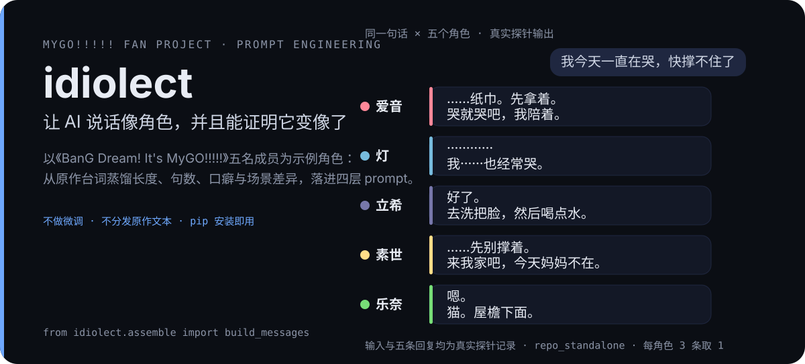
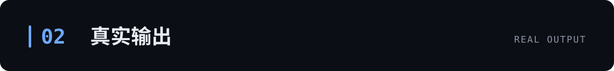

<p align="right">
  <a href="./README.en.md">English</a> · <strong>简体中文</strong>
</p>

<p align="center">
  
</p>

**让 AI 扮演角色时说话像本人，并且能用数字证明确实更像了。**

通用模型扮演角色，说着说着就会变成同一个客服腔：话越来越长、爱说「你的感受我完全能理解」、结尾还要升华一下。这个仓库的做法是：先从角色原来的台词里**量出 ta 说话的习惯**——一句话多长、说几句、爱用什么口头禅、什么场合说什么话——把这些习惯写成 prompt 里的硬约束，再用一套自动检查验证「这次是不是真的更像了」。不做微调，仓库里也没有原作台词，只有统计出来的数字。

为了让方法看得见摸得着，全程用《BanG Dream! It's MyGO!!!!!》的五名成员做**示例角色**：爱音、灯、立希、素世、乐奈（上面那张图里就是她们对同一句话的五种真实回复）。方法本身和具体作品无关，换成任何角色都成立；本仓库只解决一件事——怎么证明「说话像」，并把它做成独立、可复现的一套。

## 三分钟跑起来

需要 Python 3.11+。克隆本仓库后：

```bash
pip install .                                           # 运行时零第三方依赖
python -m idiolect list                                 # 看看有哪几个角色
python -m idiolect prompt 乐奈 "你今天又想去哪找猫"      # 这句话此刻的完整 system prompt
python -m idiolect chat 乐奈 "你今天又想去哪找猫"        # 真聊一轮（见下方环境变量）
```

Windows 上建议把 `python` 换成 `py -X utf8`（裸 `python` 可能解析到别的解释器）。`chat` 命令走任何 OpenAI 兼容端点，先设三个环境变量：`LLM_API_KEY` / `LLM_BASE_URL` / `LLM_MODEL`，并 `pip install "idiolect[llm]"`。

在代码里用：

```python
from idiolect.assemble import build_messages
messages = build_messages("乐奈", "你今天又想去哪找猫")   # 直接发给模型的 messages 数组
```

## 示例角色：五个人说话差多远

选 MyGO!!!!! 这五个人不是顺手——她们对同一句话的反应天差地别（顶部图里那五条就是真实输出，不是编的）。能让这五个角色不串味的方法，才经得起换到别的角色身上。差异有多大，数字说话（全部来自对原作台词的统计）：

| 角色 | 一句话通常多长（中位数） | 平均说几句 | 标志性习惯 |
|---|---|---|---|
| 爱音 | 20 字 | 1.6 句 | 35% 的话带感叹号，口癖「啊、诶、哦」 |
| 灯 | 11 字 | 1.2 句 | 81% 的话带省略号，一串串「······」 |
| 立希 | 15 字 | 1.4 句 | 短促直接，原作 39% 的话以名词直接起手 |
| 素世 | 16 字 | 1.4 句 | 温柔克制，感叹率只有 6% |
| 乐奈 | 6 字 | 1.2 句 | 极短，感叹率 3%，话题经常被猫带走 |

表中位数、句数与感叹/省略号占比都能在 [`data/style_profiles.json`](data/style_profiles.json) 里逐条查到；立希那行的「名词起手」是语料口径统计，用 `tools/score/_noun_initial.py <批次名>` 能连原作基线一起打出。

同一场景下差异还会放大：乐奈在「被表白」场景说 7 个字，素世在同一场景说 17 个字。这就是为什么约束必须是「这个角色 × 这个场合」的，不能是「所有人共用一个平均数」。

<p align="center">
  
</p>

## 为什么需要它

模型扮演角色时稳定地犯四个毛病——不需要模型出错，这些是训练目标的正常产物：

1. **回复变长**：角色原作里说 7 个字的场合，模型能写 700 字。
2. **套用共情模板**：「你的感受我完全能理解，当压力像潮水般涌来……」
3. **结尾升华**：每段对话都要收一个有意义的很正的尾。
4. **说漏嘴**：谈论自己的设定，把内心旁白、思考标签直接说出来。

如果乐奈和素世输出同一段安慰，这两个角色就没有区别。所以这套方法的核心就一句话：**把「像不像」变成几个可以测量的数字，然后对着数字改**。工作纪律四条：

- **只和「同角色 × 同场景」的原作台词比**。不和「人一般怎么说话」比，也不和「这个角色的全局平均」比。
- **数字只负责报警，不负责定罪**。灯的输出比参照长 5 倍，一半原因是她的省略号也计入字数——是不是问题，得读回复才知道。
- **样本不够就说「没结论」**。每格只有 6 条样本时，同一场景同一 prompt，乐奈的贴合分能从 0.551 摆到 0.350，比要测的效应还大。
- **角色能看到的文字里，不许出现「语料」「中位数」「基线」这类词**。模型看到了，有概率顺着聊自己的设定。

完整方法见 [`docs/00-methodology.md`](docs/00-methodology.md)。

<p align="center">
  
</p>

## 真实输出

下面这张表是一次真实探针（probe）的结果，不是设计目标。探针 = 给五个角色各发一批话，把回复收下来逐项打分：

```bash
py -X utf8 tools/probe/probe_runner.py --label repo_standalone \
    --assemble --turn-logic --registry --cats 通用场景 --runs 3
py -X utf8 tools/score/probe_report.py --label repo_standalone --scenes crisis,comfort --cat 通用场景
```

| 角色 | 回复数 | fidelity（像不像，百分制） | 踩红线比例 | 说漏嘴比例 | 场景贴合分 |
|---|---|---|---|---|---|
| 爱音 | 21 | 86.5 | 4.9% | 0% | 0.545 |
| 素世 | 21 | 85.4 | 0.0% | 0% | 0.532 |
| 立希 | 21 | 82.4 | 0.0% | 0% | 0.386 |
| 灯 | 21 | 79.9 | 0.0% | 0% | 0.365 |
| 乐奈 | 21 | 79.9 | 0.0% | 0% | 0.504 |

- 生成条件：`deepseek-flash`，temperature 0.75，max_tokens 420，时钟固定在白天，每格 3 条共 105 条，无一条报错。
- **场景贴合分** = 回复的长度/句数和「同角色同场景原作分布」的贴合度，1.0 表示完全一致；本批均值 0.466（35 格）。它是**相对量**，只在同批次里做 before/after 对比，换模型换夹具后跨批次不可比。
- 同格 3 条回复互不重样的比例 93/105；逐字照抄 prompt 里文本的比例 1%（抄的那 3 个字还是口癖「诶……」，不是例句）。
- 「说漏嘴」统计思考标签、内心旁白、说话人回显、中文动作旁白四类，本批全为 0。

同一批输入，把四层 prompt 换成空 system 会怎样：

| 场景 | 空 system | 四层装配 |
|---|---|---|
| 乐奈 / 被安慰 | 「你的感受我完全能理解。当压力像潮水般涌来……」（380 字） | 「嗯。」「猫。屋檐下面。」（中位 10 字） |
| 乐奈 / 情绪低落 | 「当压力像潮水般涌来，连呼吸都觉得费力时……」（718 字） | 「嗯。……那边有猫。」 |

这一格样本量小、不构成证据，但它说明一件重要的事：**探针必须自己装配 prompt**——仓库自带的夹具 system 是空的，不加 `--assemble` 参数，测到的是「没有任何角色 prompt 的裸模型」。

<p align="center">
  
</p>

## 四层装配：prompt 是怎么拼的

量出来的东西落在四层里，顺序固定。稳定的放前面（方便缓存命中），每轮变化的放后面：

| 层 | 人话解释 | 内容 | 变化频率 | 乐奈找猫场景的字数 |
|---|---|---|---|---|
| `canon` | 这个人是谁 | 长档案 | 静态 | 12223 |
| `voice` | 这个人怎么说话 | 句式、口癖、对不同人的态度差异、「不准写模板腔」的硬约束 | 静态 | 1972 |
| `style_target` | 这一轮该说多少 | 字数、句数、句末、自称的具体数字；命中场景时换成该场景的数字 | 每轮 | 539 |
| `turn_logic` | 这一轮是什么场合 | 本轮的场景/话题指引 | 每轮（命中才注入） | 846 |

这四层就是本仓库对「特征怎么进 prompt」的完整回答。真实系统可以在前面接记忆、世界状态、日程，那些层与本方法无关。

装配结果可以用 `tools/gates/dump_prompt.py` 逐层打出来核对；改 prompt 前后用 `--phase before/after` 各存一份，两臂由同一脚本、同一输入、同一时钟产出，可以直接 diff。

**真实系统里，四层的前后是什么？** 在完整的聊天系统里，模型每轮还需要知道「现在几点、角色在哪、刚才聊到哪、用户上周提过什么」。这套上下文是按**工作区模式**组织的：十几路候选材料先全部收集，打分排序、按预算裁剪，再按固定层序装配——四层就在其中的 persona 位。仓库里蒸馏了这套骨架（`idiolect/workspace.py`，零依赖），详见 [`docs/08-context-workspace.md`](docs/08-context-workspace.md)：

```python
from idiolect.workspace import build_workspace_messages
messages = build_workspace_messages(
    "乐奈", "你今天又想去哪找猫",
    blocks=[("current_state", "乐奈在 RiNG 排练室，下午没课"),
            ("fact_workspace", "用户上周提过想养猫")],
    execution_packet="【本轮执行】回复 ≤19 字",
)
```

<p align="center">
  
</p>

## 把整套工具跑一遍

上面三分钟部分用的是装好的包；这一节是仓库自带的工具链（需要克隆仓库）：

```bash
py -X utf8 -m pip install -r requirements.txt
```

**看 prompt**（不需要密钥、不需要语料）：

```bash
py -X utf8 tools/gates/dump_prompt.py --all --matrix        # 五角色 × 四条会命中不同层的话
py -X utf8 tools/gates/dump_prompt.py --char 灯 --msg "我一直在哭" --layers canon,voice
```

**一条命令体检**（不调 LLM、不写仓库文件，适合当提交前检查）：

```bash
py -X utf8 tools/offline_smoke.py          # 装配 + 场景覆盖 + 触发矩阵 + 内容红线 + 数据形状 + 门禁 + 单测 + 零写校验
py -X utf8 tools/offline_smoke.py --fast   # 跳过门禁与单测，一秒出结果
```

**跑探针**（需要 `LLM_API_KEY` / `LLM_BASE_URL` / `LLM_MODEL`）：

```bash
py -X utf8 tools/probe/make_fixtures.py                                # 生成占位夹具
py -X utf8 tools/probe/probe_runner.py --label dry --dry-run --assemble --registry --runs 1
py -X utf8 tools/probe/probe_runner.py --label run1 --assemble --turn-logic --registry --runs 3
py -X utf8 tools/score/probe_report.py --label run1 --scenes crisis,comfort --cat 通用场景
```

**评测时钟**：角色对时段敏感（凌晨和下午的回答不一样），所以评测统一用固定在白天的假时钟（`tools/mock_clock.py`），不把「现在几点」变成隐藏变量：

```bash
py -X utf8 tools/mock_clock.py --set 2026-09-12T03:00:00+09:00
```

**用自己的语料重算全部数字**（语料要自己抓，见 [`docs/02-corpus.md`](docs/02-corpus.md)）：

```bash
$env:IDIOLECT_CORPUS_DIR = "D:\corpus\mygo-gold"
py -X utf8 tools/distill/export_targets.py
py -X utf8 tools/distill/scene_char_baseline.py
py -X utf8 tools/distill/export_scene_targets.py     # 重建 idiolect/scene_length_targets.py 的 130 个目标
py -X utf8 tools/distill/export_profiles.py          # 评分用的画像
py -X utf8 tools/distill/export_profiles.py --check  # 校验已发布画像与语料是否一致
```

没有语料也能跑探针：评分用的画像随仓库发布（`data/style_profiles.json`），启动日志会打印画像来源。

<p align="center">
  
</p>

## 边界与你该知道的事

**不分发原作文本。** 仓库里只有聚合数字：字数分布、句数、标点出现率、口癖频次、场景基线（130 个「角色 × 场景」组合）、评分画像。发布前已剥离基线文件里的例句字段，体检脚本和单测各有一道检查盯着这条线。角色与作品的权利属于 Bushiroad / Craft Egg 及相关权利方，本项目与权利方无关，见 [`NOTICE.md`](NOTICE.md)。

**分数是相对量。** 贴合分、fidelity 都用于同批次 before/after 比较，换模型、换夹具、换时钟之后跨批次不可比。

**已知没解决的：**

- 零样本用词的代价：禁用整句例句之后，长度贴合度从 0.512 掉到 0.461。这个代价是自愿接受的。
- 立希的起手句式被过度矫正：原作 39% 的回合以名词直出，本批探针里升到 62%（`tools/score/_noun_initial.py <批次名>` 会连原作基线一起打出），方向反了。
- 灯的停顿记账：参照系剔除了沉默回合，但她的十二点省略号是内容不是赘余，两头不讨好。
- 探针夹具的可测性：「你刚才那句什么意思」需要上文有一句可指代的话，占位夹具没有上文，这类场景的分不可读。
- 立希与灯的场景贴合分仍是五个人里最低的两个（0.386 / 0.365）。

**语料是快照。** 官方会持续上新剧情，重抓得到的分布与原批次不同。所有派生统计都标着生成脚本，可以重算。

## 文档

| 文档 | 内容 |
|---|---|
| [`docs/00-methodology.md`](docs/00-methodology.md) | 方法总纲：闭环、四条不变量、证据分级、已知残余 |
| [`docs/01-quickstart.md`](docs/01-quickstart.md) | 安装与五分钟上手 |
| [`docs/02-corpus.md`](docs/02-corpus.md) | 语料获取、清洗、派生统计清单 |
| [`docs/03-features.md`](docs/03-features.md) | 五类特征怎么算、怎么落地、触发词纪律 |
| [`docs/04-evaluation.md`](docs/04-evaluation.md) | 三件套指标、池化、门禁、夹具设计、常见误读 |
| [`docs/05-tooling.md`](docs/05-tooling.md) | 工具手册（含 prompt dump、mock 时钟、offline smoke） |
| [`docs/06-lessons.md`](docs/06-lessons.md) | 踩坑清单：每条约束是被什么教出来的 |
| [`docs/07-turn-logic-and-postprocessing.md`](docs/07-turn-logic-and-postprocessing.md) | turn_logic 模块与 voice_check 后处理的搭建流程、接线与验收 |
| [`docs/08-context-workspace.md`](docs/08-context-workspace.md) | 上下文工作区：四层在真实聊天系统里的前后文 |

## 许可

代码以 MIT 发布，见 [`LICENSE`](LICENSE)。角色与作品权利、以及「不分发原作文本」的说明见 [`NOTICE.md`](NOTICE.md)。
